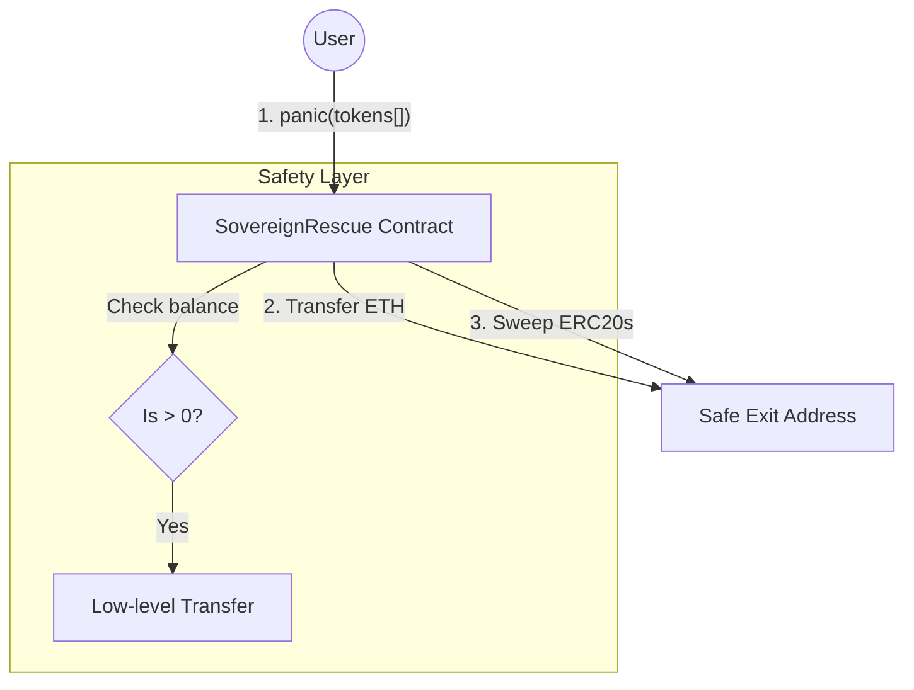

# Sovereign Rescue

Atomic emergency evacuation for assets on Base.
**One transaction. Full recovery. Zero dependencies.**

> "Simplicity is the ultimate sophistication."

---

## The Problem

When a private key is compromised, the user enters a race against time. Traditional methods rely on manual transfers or off-chain Python/JS scripts to sweep assets.
**Critique:** In a crisis, you don't have time to fix your Node.js environment or handle nonce errors. Off-chain scripts are fragile; if the script crashes or the internet lags, the hacker wins.

## The Solution: Atomic Exit

Sovereign Rescue is a pre-deployed, on-chain "panic button." It allows you to evacuate all ETH and a list of ERC20 tokens to a pre-defined safe address in a single, atomic EVM transaction.

1. **Atomic Execution:** Either everything is rescued, or nothing is. No "in-between" state for hackers to exploit.
2. **EVM-Native:** Works directly inside the protocol. No dependencies on external APIs or bots.
3. **Resilience:** Uses low-level calls to ensure that one "malicious" or non-standard token doesn't break the entire rescue process.

---

## Architecture

We reject complexity. The contract uses a simple loop with low-level safety checks to ensure maximum reliability during high-stress scenarios.



---

## Design Philosophy (First Principles)

### 1. Atomic Sweep

By grouping all transfers into one transaction, we minimize the window of opportunity for front-running bots. If your transaction is included in a block, the wallet is emptied before the hacker can react to individual transfers.

### 2. Low-Level Compatibility

We use `call` with manual signature encoding instead of a high-level `IERC20` interface. This ensures compatibility with non-standard tokens (like those that don't return a boolean) and prevents the entire transaction from reverting if one `balanceOf` call fails.

```solidity
// Example of the safe sweep logic
(bool success, bytes memory data) = token.call(
    abi.encodeWithSignature("balanceOf(address)", address(this))
);

```

### 3. Immutable Security

The `safeExit` address is set at deployment and is `immutable`. This guarantees that even if a hacker gains access to the contract's functions, they cannot redirect the rescue flow to their own address.

---

## Tech Stack

* **Contracts:** Solidity 0.8.26, Foundry (Forge)
* **Chain:** Base Mainnet

## Run Locally

### 1. Contracts (Foundry)

```bash
# Install dependencies
forge install

# Run tests
forge test -vv

```

---

## License

This project is open source and available under the [MIT License](https://opensource.org/licenses/MIT).

### Author

Built with 💙 on Base by [Roman](https://www.linkedin.com/in/tilmatochek/).
